# 景気ウォッチャー調査 分析レポート
**出典**: 景気ウォッチャー調査（内閣府）
**データ期間**: 2000年1月〜2026年2月
**分析日**: 2026年3月14日

---

## 目次

1. [調査概要](#1-調査概要)
2. [長期トレンド分析](#2-長期トレンド分析)
3. [分野別・業種別分析](#3-分野別業種別分析)
4. [地域別分析](#4-地域別分析)
5. [季節調整値と現状・先行き比較](#5-季節調整値と現状先行き比較)
6. [回答者構成比分析](#6-回答者構成比分析)
7. [業種別・地域別年次ヒートマップ](#7-業種別地域別年次ヒートマップ)
8. [主要経済イベントの影響](#8-主要経済イベントの影響)
9. [2026年2月の最新動向](#9-2026年2月の最新動向)
10. [総合考察と政策的示唆](#10-総合考察と政策的示唆)

---

## 1. 調査概要

### 景気ウォッチャー調査とは

景気ウォッチャー調査は、地域の景気動向を肌で感じる立場にある人々（**景気ウォッチャー**）を対象に、内閣府が毎月実施する月次調査です。全国2,050人の景気ウォッチャーに対し、景気の現状・先行きを5段階（◎良くなっている／○やや良くなっている／□変わらない／▲やや悪くなっている／×悪くなっている）で評価してもらい、その加重平均として**DI（景気ウォッチャー指数）**を算出します。

- **DI > 50**: 景気が回復・拡大局面
- **DI = 50**: 中立
- **DI < 50**: 景気が後退・悪化局面

> 📊 **データ出典**: 内閣府「景気ウォッチャー調査」統計表 (https://www5.cao.go.jp/keizai3/watcher.html)

### データ構成

| ファイル | 内容 | 期間 |
|---------|------|------|
| watcher3.xls | 全国・分野別DI推移（原系列） | 2000年〜2026年2月 |
| watcher5.xls | 全国・地域別DI（季節調整値） | 2002年〜2026年2月 |
| watcher2-1.xls | 全国・回答者数・構成比・DI | 2001年〜2026年2月 |
| watcher2-2〜7.xls | 地域別詳細・判断理由 | 2001年〜2026年2月 |
| watcher4.xls | 景気ウォッチャー構成（地域・分野別） | 参照テーブル |

---

## 2. 長期トレンド分析

### DI長期推移（2000年〜2026年2月）

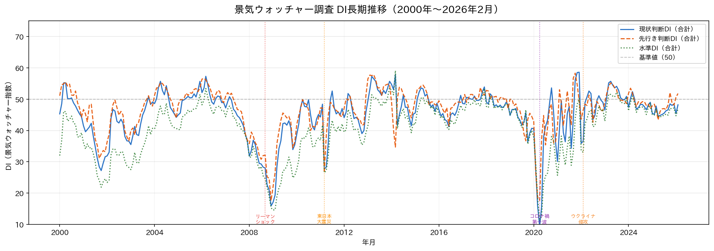

2000年から2026年2月にかけての景気ウォッチャーDI（全国合計）の推移を示します。現状判断・先行き判断・水準の3指標を重ねることで、景気サイクルと主要イベントの影響を可視化しています。

**主な観察点**:
- **2008年リーマンショック**: DI が急落し、2009年初頭に底（約20台前半）を記録
- **2011年東日本大震災**: 急落後、急速な回復（V字回復）
- **2020年コロナ禍**: 2020年4月に現状判断DI が過去最低水準（約19台）に急落
- **2022年以降**: 段階的回復が続き50近傍で推移

### 直近2年の月次DI推移（2024年〜2026年）

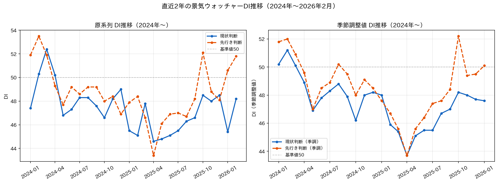

2024年以降、原系列・季節調整値ともに45〜52ptの狭いレンジで推移。天候・季節変動の影響を除いた季節調整値では緩やかな改善傾向が見られます。

---

## 3. 分野別・業種別分析

### 分野別DI推移（家計動向・企業動向・雇用関連）

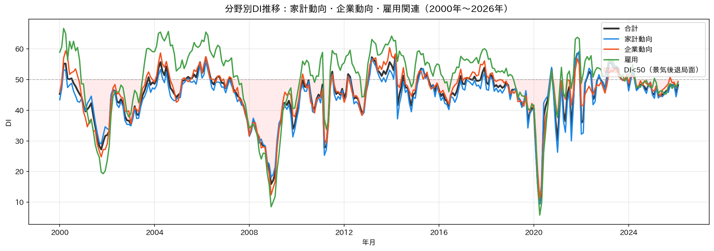

景気ウォッチャーDIは3つの主要分野に分類されます。

| 分野 | 直近年平均（2025年） | 特徴 |
|------|---------------------|------|
| **家計動向関連** | 約47pt | 消費者心理を反映。季節性が大きい |
| **企業動向関連** | 約49pt | 製造・非製造業の景況感 |
| **雇用関連** | 約51pt | 労働市場の引き締まりを反映し相対的に高水準 |

### 業種別DI詳細（6業種）

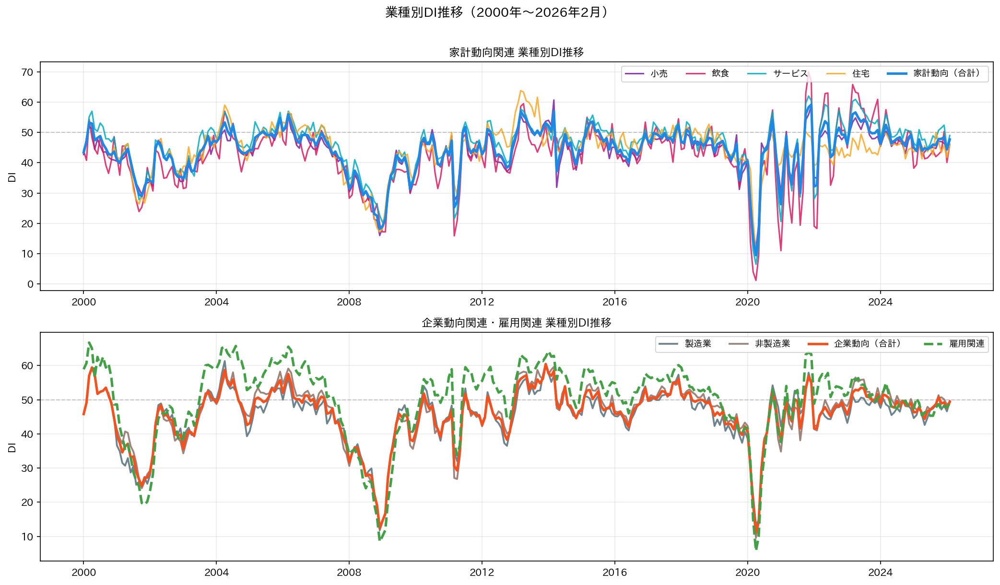

**家計動向関連の業種別特徴**:
- **小売関連**: 大型連休・セール時期に季節変動が大きい
- **飲食関連**: コロナ禍で最も大きく落ち込み、回復も顕著
- **サービス関連**: 旅行・交通・レジャーを含み、コロナ後の回復が鮮明
- **住宅関連**: 金利環境・住宅需要に敏感

**企業動向関連**:
- **製造業**: グローバル景気・輸出環境に連動しやすい
- **非製造業**: 国内需要・インバウンドの影響を受ける

---

## 4. 地域別分析

### 地域別DI比較（最新3ヶ月・季節調整値）

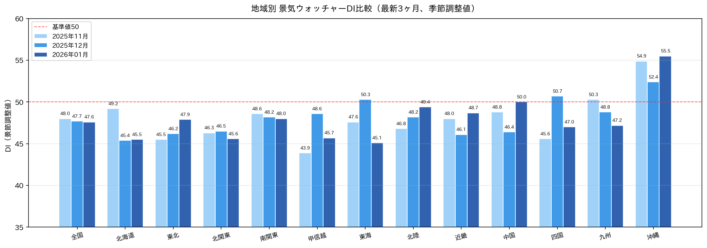

直近3ヶ月の地域別DIを比較すると、地域間で3〜8ポイント程度の格差が見られます。

### 地域別DI推移ヒートマップ（2021年〜2026年）

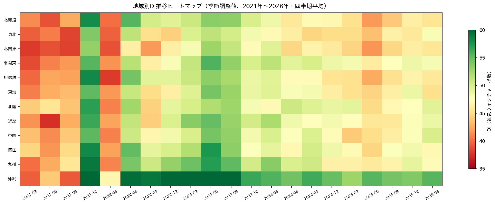

色の濃さで景気の強弱を直感的に把握できます。**赤**が景気後退局面（DI低）、**緑**が景気拡大局面（DI高）を示します。

### 地域別年平均DI推移（主要地域）

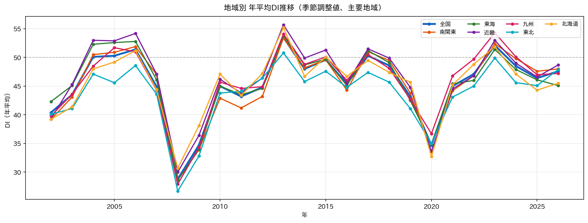

**地域格差の特徴**:
- **東海・南関東**: 自動車産業・大都市圏の強みで相対的に高水準を維持
- **近畿**: 大阪万博効果もあり2025年に改善傾向
- **東北・北陸**: 地方経済の構造的課題が反映される場面もあり
- **沖縄**: 観光業の回復でコロナ後に急回復

---

## 5. 季節調整値と現状・先行き比較

### 季節調整値DI推移（全国合計）

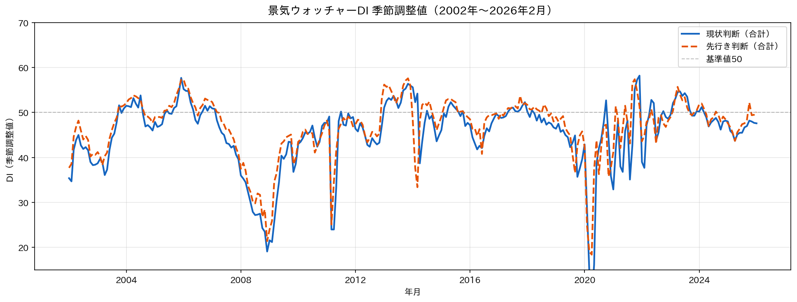

季節変動を除いた系列で見ると、基調的なトレンドが把握しやすくなります。

### 現状判断 vs 先行き判断のギャップ分析

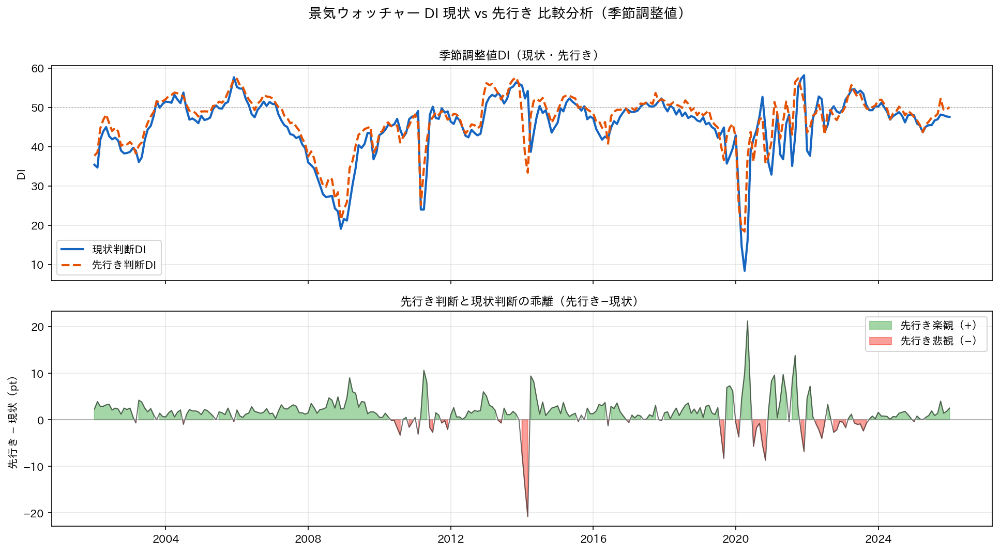

**先行き判断 − 現状判断**の差（ギャップ）は、景気の方向感を示す重要指標です。

| ギャップ | 意味 |
|---------|------|
| **プラス** | 先行きを現状より楽観 → 景気回復期待 |
| **ゼロ近傍** | 現状維持の見通し |
| **マイナス** | 先行きを現状より悲観 → 景気後退懸念 |

2026年2月時点は先行き判断（50.0）が現状判断（48.9）を+1.1pt上回っており、**緩やかな楽観**が維持されています。

---

## 6. 回答者構成比分析

### 回答者構成比推移（積み上げ面グラフ）

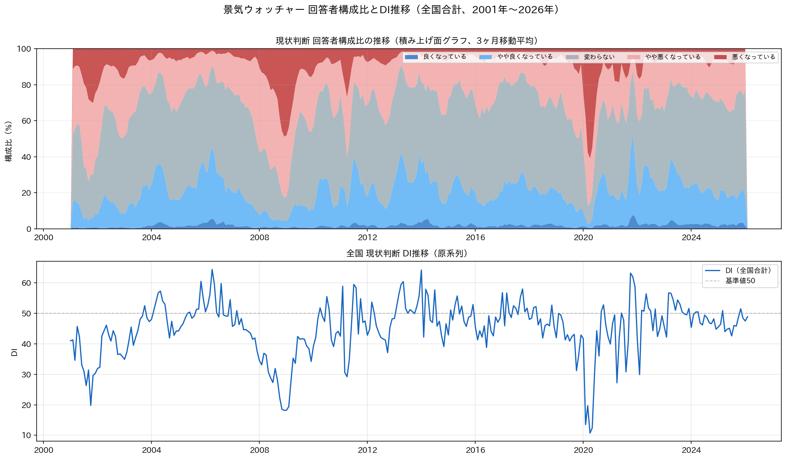

5段階評価の回答割合の推移を可視化しました。

**特徴的な動き**:
- **コロナ禍（2020年）**: 「悪くなっている」（×）の割合が急増し、構成比の逆転が起きた
- **2022〜2024年**: 「変わらない」（□）が最も多い安定局面
- **2026年2月**: 「やや良くなっている」が前月より増加し、DI上昇に寄与

---

## 7. 業種別・地域別年次ヒートマップ

### 業種別DI年次ヒートマップ（2003年〜2026年）

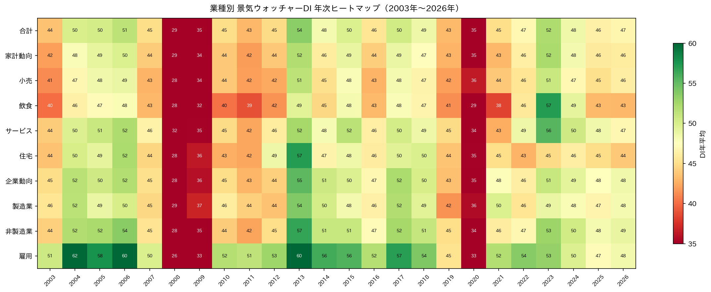

各業種の年平均DIを色で表現したヒートマップ。**横軸が年、縦軸が業種**。

**注目点**:
- 2008〜2009年（リーマン禍）: 全業種で赤系（低DI）
- 2020年（コロナ）: 全業種で最低水準→2021年急回復
- 雇用関連: 一貫して高めのDIを維持（労働市場の底堅さ）

---

## 8. 主要経済イベントの影響

### 主要イベントとDIの推移

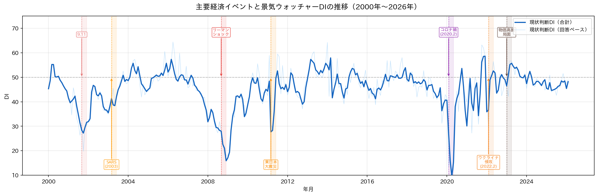

過去の主要経済イベントが景気ウォッチャーDIに与えた影響を可視化しました。

| イベント | 発生時期 | DI変動 | 回復にかかった期間 |
|---------|---------|--------|-----------------|
| 9.11テロ | 2001年9月 | 軽度の下落 | 約3〜6ヶ月 |
| リーマンショック | 2008年9月 | 急落（〜20台前半） | 約1.5〜2年 |
| 東日本大震災 | 2011年3月 | 急落→V字回復 | 約4〜6ヶ月 |
| コロナ禍第一波 | 2020年3〜4月 | 過去最大の急落（〜19台） | 約1〜1.5年 |
| ウクライナ侵攻 | 2022年2月 | 緩やかな下落 | 約1年 |

> 🌐 **参考**: ニッセイ基礎研究所「景気ウォッチャー調査2026年2月〜天候回復で現状改善、値上げ懸念で先行き慎重〜」(https://www.nli-research.co.jp/report/detail/id=84837?site=nli)

---

## 9. 2026年2月の最新動向

### 概要

> 🌐 **出典**: 日本経済新聞「2月の街角景気、基調判断は『持ち直し』維持 4カ月ぶりの上昇」(https://www.nikkei.com/article/DGXZQOUA0944S0Z00C26A3000000/)

| 指標 | 値 | 前月比 |
|------|-----|-------|
| 現状判断DI（季節調整値） | **48.9** | +1.3pt ↑ |
| 先行き判断DI（季節調整値） | **50.0** | -0.1pt → |
| 基調判断 | **持ち直している** | 据え置き |

**分野別変化**（前月比）:
- 家計動向関連: +1.7pt（天候回復でサービス・飲食が改善）
- 企業動向関連: +0.4pt（緩やかな改善）
- 雇用関連: +0.4pt（雇用環境の底堅さ継続）

**注意点**: 米国関税政策の影響は調査時点では未反映。3月以降の調査で変化が現れる可能性があります。

---

## 10. 総合考察と政策的示唆

### 現状評価

2026年2月の景気ウォッチャーDIは**「持ち直し」基調を維持**しているものの、DI値は基準値50を下回っており、力強い回復感はまだ見られません。天候回復という一時的要因を除けば、基調的な改善はゆるやかです。

### 構造的課題

1. **関心-行動ギャップ**: 先行き判断が現状判断を僅かに上回っているが、楽観の根拠が薄い
2. **地域格差**: 大都市圏・観光地 vs. 地方・製造業地帯の格差が継続
3. **コスト高の影響**: 食料・エネルギー価格の高止まりが家計消費を圧迫

### 先行きリスク

| リスク要因 | 影響方向 | 時期 |
|-----------|---------|------|
| 4月以降の値上げ | 家計消費↓ | 2026年4月〜 |
| 米国関税政策 | 企業動向↓ | 2026年春〜 |
| 労務費上昇 | 企業収益↓ | 継続 |
| 春の行楽需要 | 家計動向↑ | 2026年3〜5月 |
| 賃上げ実施 | 消費↑（遅効） | 2026年4月〜 |

### データの限界

- 本調査は**主観的評価**であり、速報性は高いが客観的経済指標と乖離する場合がある
- 回答者構成は業種・地域により固定されており、産業構造変化を反映しにくい
- 月次の変動には天候・行事・季節など一時的要因が混在する

---

*© 2026 分析レポート. データ出典：内閣府「景気ウォッチャー調査」*
