# 公益社団法人・公益財団法人の寄附金収入に関する実態調査 — 分析レポート

## 調査概要

| 項目 | 内容 |
|------|------|
| 出典 | 内閣府「公益法人の寄附金収入に関する実態調査」（令和元年度実施） |
| 対象 | 公益社団法人・公益財団法人（全法人） |
| 有効回答数 | 3,987法人（回収率46.8%） |
| 集計対象 | 約6,155法人 |
| データ期間 | 平成26年度〜平成30年度（2014〜2018年度） |
| テーマ | 寄附金収入の実態・税額控除制度・募金活動 |

> 📊 以下のデータはすべて調査データからの直接引用です。🌐 マークはWeb検索による補足情報を示します。

---

## 1. 法人の基本属性

### 1.1 公益目的事業費用の規模分布

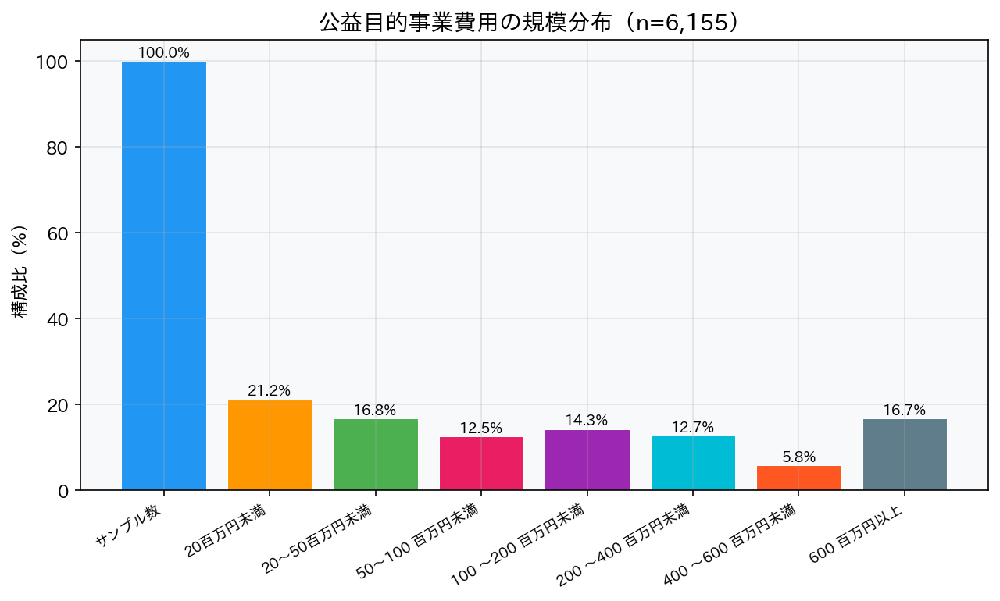

公益法人の事業費用規模は二極化が顕著です。

| 規模 | 構成比 |
|------|--------|
| 20百万円未満 | 21.2%（最多） |
| 20〜50百万円 | 16.8% |
| 50〜100百万円 | 12.5% |
| 100〜200百万円 | 14.3% |
| 200〜400百万円 | 12.7% |
| 400〜600百万円 | 5.8% |
| 600百万円以上 | 16.7% |

📊 小規模法人（20百万円未満）が最多ながら、600百万円以上の大規模法人も16.7%存在し、規模の二極化が顕著。

---

## 2. 寄附金収入の実態

### 2.1 寄附金収入金額の年次推移

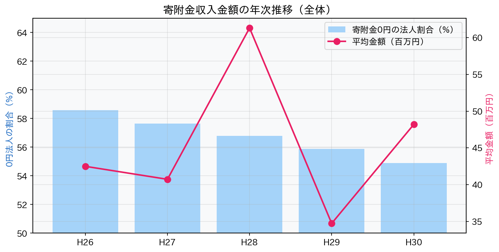

📊 **過半数の公益法人は寄附金収入がゼロ**。寄附金0円の法人割合は以下のとおり推移：

| 年度 | 0円法人割合 |
|------|-----------|
| H26（2014） | 58.6% |
| H27（2015） | 57.6% |
| H28（2016） | 56.8% |
| H29（2017） | 55.9% |
| H30（2018） | 54.9% |

改善傾向にあるものの、依然として過半数が寄附を受けていない状況。

### 2.2 個人寄附 vs 法人寄附

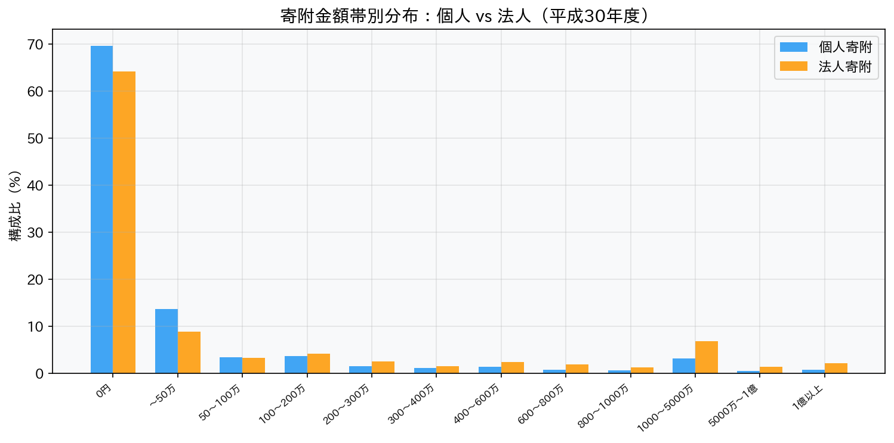

📊 平成30年度の金額帯別分布：
- **個人寄附**: 0円が69.7%、1億円以上はわずか0.7%
- **法人寄附**: 0円が64.2%、1億円以上は2.1%

法人寄附の方が「寄附あり」の割合がやや高く、高額帯（1,000万円以上）では法人寄附が個人を大幅に上回る。

### 2.3 寄附金収入総額の推移（H20〜H24）

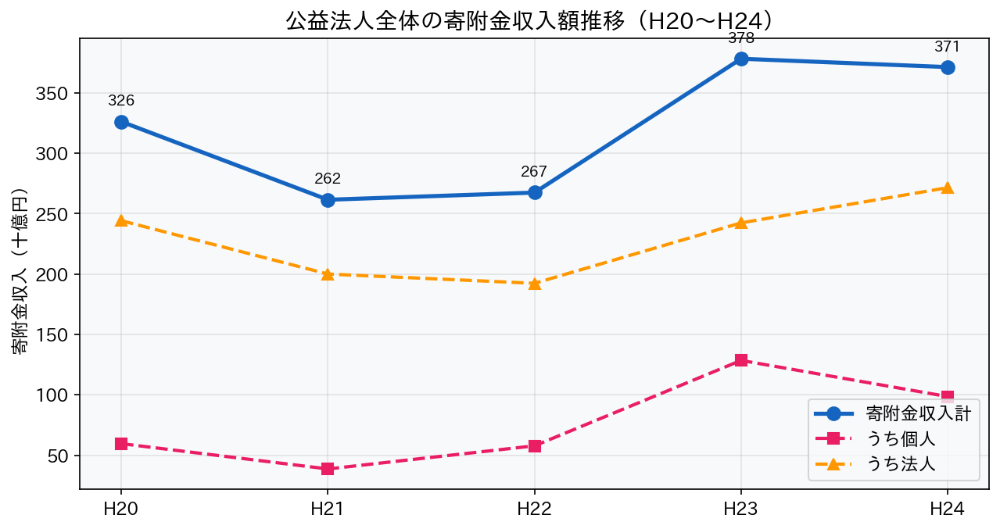

📊 公益法人全体の寄附金収入額（十億円）：

| 年度 | 合計 | 個人 | 法人 |
|------|------|------|------|
| H20（2008） | 326 | 60 | 244 |
| H21（2009） | 262 | 39 | 200 |
| H22（2010） | 267 | 58 | 192 |
| H23（2011） | 378 | 128 | 242 |
| H24（2012） | 371 | 99 | 272 |

🌐 H23年度（2011年）の急増は**東日本大震災**の影響。個人寄附が前年比2.2倍に急増した。（[日本ファンドレイジング協会「寄付白書」](https://jfra.jp/pdf/gj2025_infographic.pdf)）

---

## 3. 税額控除制度の効果分析

### 3.1 制度概要

🌐 平成23年度税制改正により、PST（パブリック・サポート・テスト）要件を満たす公益法人への個人寄附について、**（寄附金額−2,000円）×40%** を所得税から控除できる税額控除制度が創設された。（[国税庁 No.1266](https://www.nta.go.jp/taxes/shiraberu/taxanswer/shotoku/1266.htm)）

### 3.2 導入前後の増加率比較

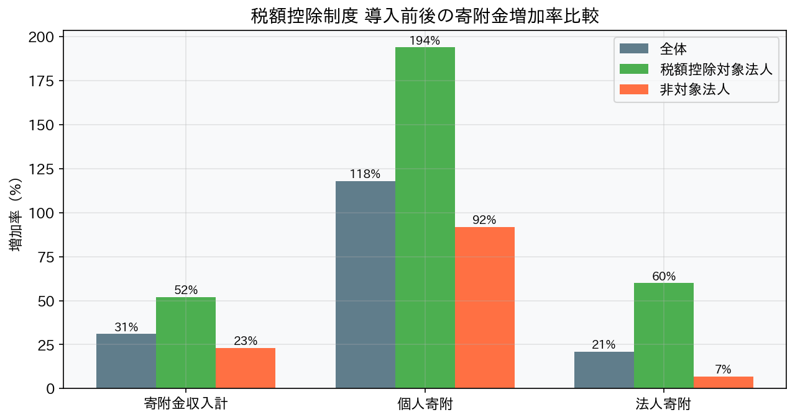

📊 税額控除制度の導入（H23年度）前後で平均額を比較：

| 指標 | 全体 | 税額控除対象法人 | 非対象法人 |
|------|------|----------------|----------|
| 寄附金収入計 | +31% | +52% | +23% |
| 個人寄附 | +118% | **+194%** | +92% |
| 法人寄附 | +21% | +60% | +7% |

税額控除対象法人の個人寄附は**+194%**と劇的に増加。制度の明確なインセンティブ効果が確認される。

### 3.3 税額控除対象法人の状況

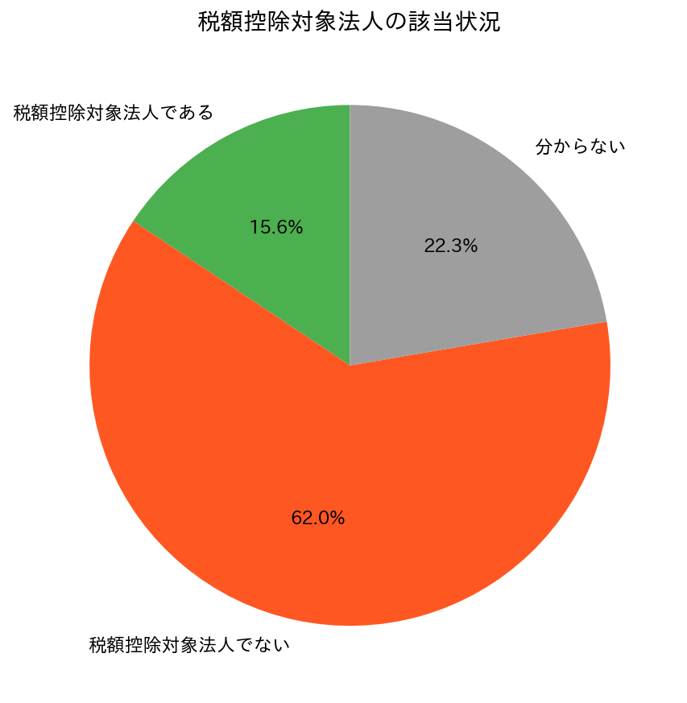

📊 税額控除対象法人はわずか**8.6%**（341法人/3,987法人）。大多数の公益法人は税額控除の恩恵を受けていない。

🌐 PST要件：①判定基準寄附者数が年平均100人以上、②受入寄附金総額が年平均30万円以上、③経常収入に占める寄附金割合が1/5以上のいずれか。小規模法人にとってハードルが高い。（[公益法人Information](https://www.koeki-info.go.jp/pictis_portal/other/pdf/kifuzeisei.pdf)）

🌐 H28年度税制改正で、公益目的事業費用1億円未満の法人に対するPST要件の緩和措置が導入され、寄附者数の算定で最大5倍のカウントが可能に。（[PST要件の緩和 - 月刊公益オンライン](https://online.koueki.jp/article/160701_03/)）

---

## 4. 寄附金の必要性と活動状況

### 4.1 寄附金収入の必要性

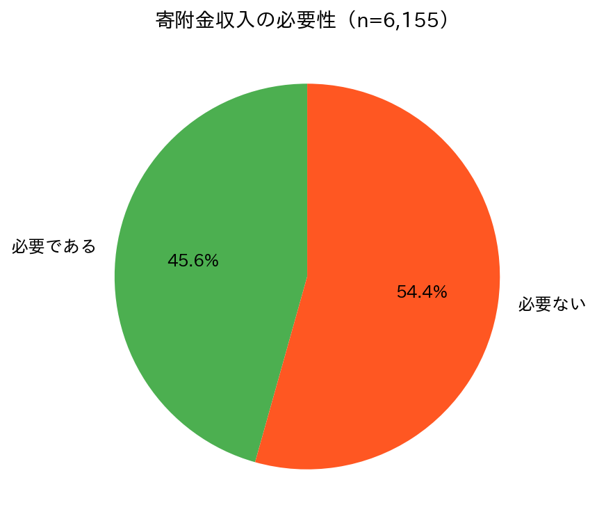

### 4.2 必要な理由

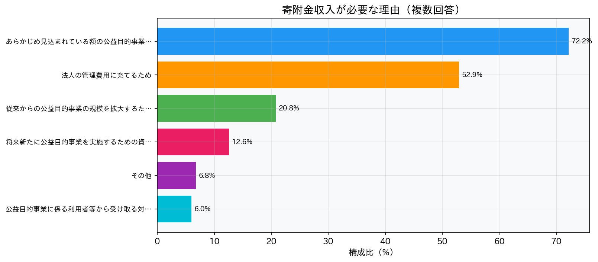

📊 寄附金収入が必要な理由（複数回答）：
- 経営基盤の強化（38.9%の法人）
- 臨時支出への資金調達（11.1%の法人）

### 4.3 寄附金を得るための活動

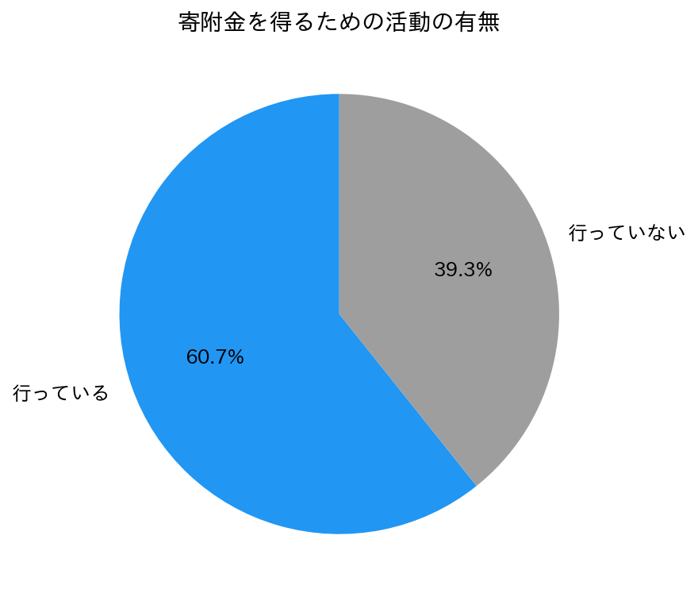

📊 寄附金の必要性を認識しながらも、実際に活動を行っている法人は限定的。**「必要性と行動のギャップ」**が存在する。

### 4.4 寄附金が必要でない理由

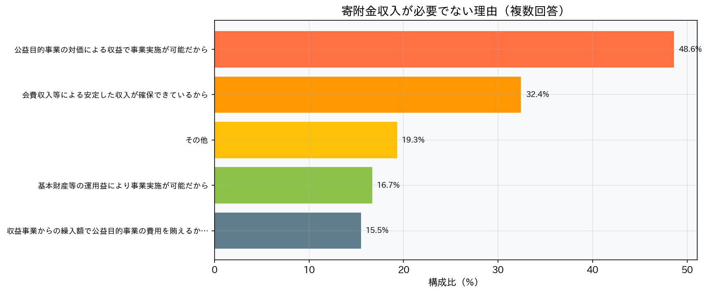

---

## 5. 募金活動の手段

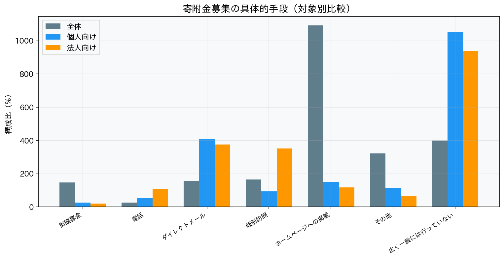

📊 寄附金募集の具体的手段（対象別）：

| 手段 | 特徴 |
|------|------|
| ホームページへの掲載 | 最も一般的な手段 |
| ダイレクトメール | 個人向けに活用 |
| 個別訪問 | 法人向けに有効 |
| 街頭募金 | 割合は低い |
| 電話 | 限定的 |

🌐 近年はオンライン決済やクラウドファンディングの活用が広がっているが、本調査時点（H30）では「ホームページへの掲載」が主流。デジタル化の推進余地が大きい。

---

## 6. 寄附金の使途

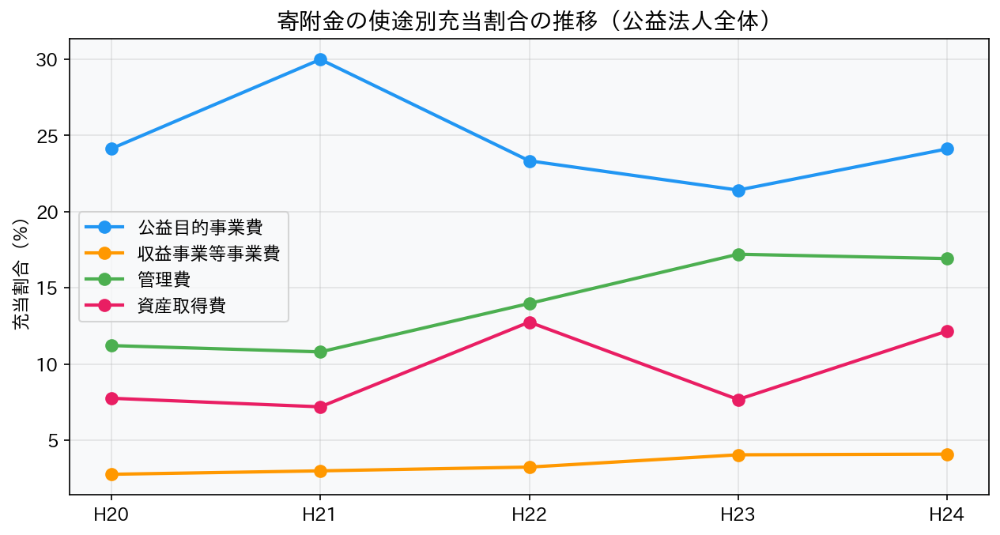

📊 寄附金の使途別充当割合（H24年度）：

| 使途 | 公益法人全体 | 税額控除対象法人 |
|------|------------|----------------|
| 公益目的事業費 | 24.1% | 64.2% |
| 管理費 | 16.9% | 44.1% |
| 資産取得費 | 12.2% | 12.6% |
| 収益事業等事業費 | 4.1% | 5.2% |

税額控除対象法人は公益目的事業費への充当率が**64.2%**と顕著に高く、寄附金が本来の公益活動に有効に使われていることが確認される。

---

## 7. 総合考察

### 主要知見

| テーマ | 知見 |
|--------|------|
| 寄附金の二極化 | 過半数（約55%）の公益法人は寄附金収入がゼロ。少数の大規模法人に集中 |
| 税額控除の効果 | 対象法人の個人寄附は+194%。制度による明確なインセンティブ効果 |
| 法人寄附が主力 | 寄附金総額の約7割は法人寄附。個人寄附の拡大余地は大きい |
| 活動ギャップ | 必要性を認識しつつも募金活動を行っていない法人が多い |
| PST要件の壁 | 税額控除対象法人は8.6%。小規模法人のハードルが高い |

### 政策的示唆

1. **PST要件のさらなる緩和** — H28年度の緩和に続き、小規模法人が要件を満たしやすくする制度設計が必要
2. **デジタル化の推進** — オンライン決済・クラウドファンディング等の活用促進
3. **情報発信支援** — 募金活動のノウハウ・成功事例の共有による底上げ
4. **寄附文化の醸成** — 個人寄附の拡大に向けた社会的機運の醸成

🌐 2024年には改正公益法人制度が成立し、遊休財産規制の見直し・会計報告の簡素化等の改革が進行中。（[内閣府 公益法人制度改革](https://www.cao.go.jp/others/koeki_kanshi/koeki_kanshi.html)）

---

## 参考文献・出典

- 📊 内閣府「[令和元年度 公益法人の寄附金収入に関する実態調査](https://www.koeki-info.go.jp/contribute/kifukin-toukei.html)」
- 📊 e-Stat「[公益法人の寄附金収入に関する実態調査](https://www.e-stat.go.jp/statistics/00100501)」
- 🌐 国税庁「[No.1266 公益社団法人等に寄附をしたとき](https://www.nta.go.jp/taxes/shiraberu/taxanswer/shotoku/1266.htm)」
- 🌐 公益法人Information「[税制上の優遇について](https://www.koeki-info.go.jp/pictis_portal/other/pdf/kifuzeisei.pdf)」
- 🌐 公益法人協会「[寄附金控除について](https://kohokyo.or.jp/jaco40/contribution/kifu_kojo/)」
- 🌐 日本ファンドレイジング協会「[寄付白書2025](https://jfra.jp/pdf/gj2025_infographic.pdf)」
